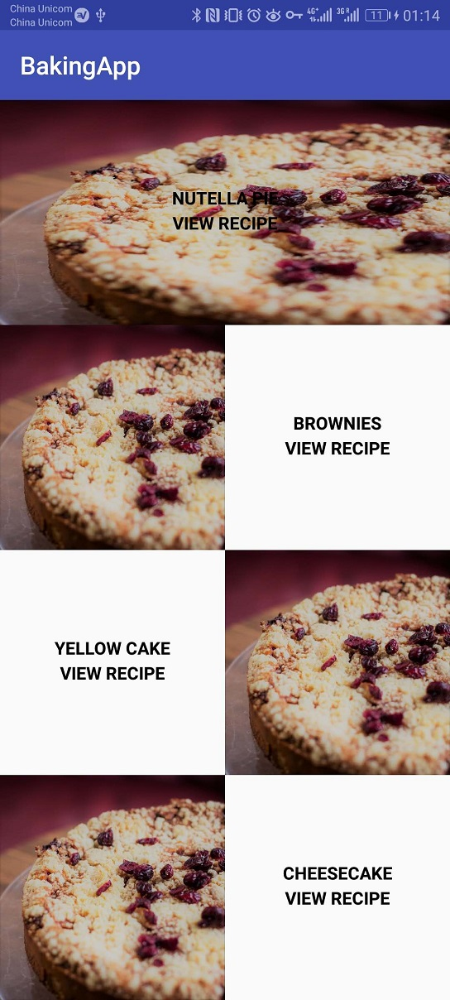
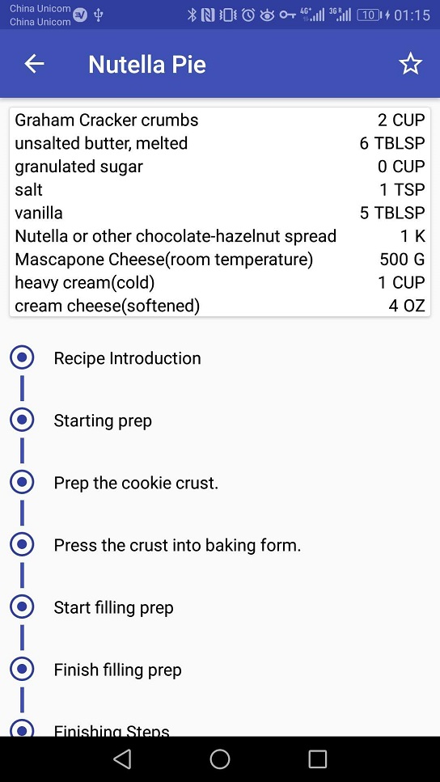
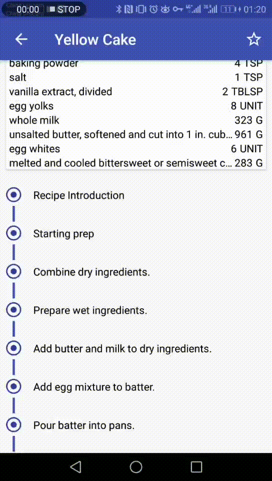

# BakingApp  

## Project Overview

You will productionize an app, taking it from a functional state to a production-ready state. This will involve finding and handling error cases, adding accessibility features, allowing for localization, adding a widget, and adding a library.

## ScreenShots

### Mobile

Main Menu|Overview|Step 
:-------------------------:|:-------------------------:|:-------------------------:|
||  

### Tablet

Overview + Step | 
:-------------------------:
| 
## Libraries
* [rxAndroid](https://github.com/ReactiveX/RxAndroid) - Library for composing asynchronous and event-based programs by using observable sequences.
* [Butterknife](https://jakewharton.github.io/butterknife/) - Field and method binding for Android views
* [Retrofit2](http://square.github.io/retrofit/) - A type-safe HTTP client for Android and Java
* [Picasso](https://square.github.io/picasso/) - A powerful image downloading and caching library for Android
* [Jackson](https://github.com/FasterXML/jackson) - JSON parser for Java

